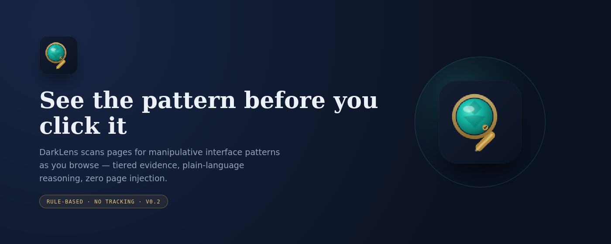
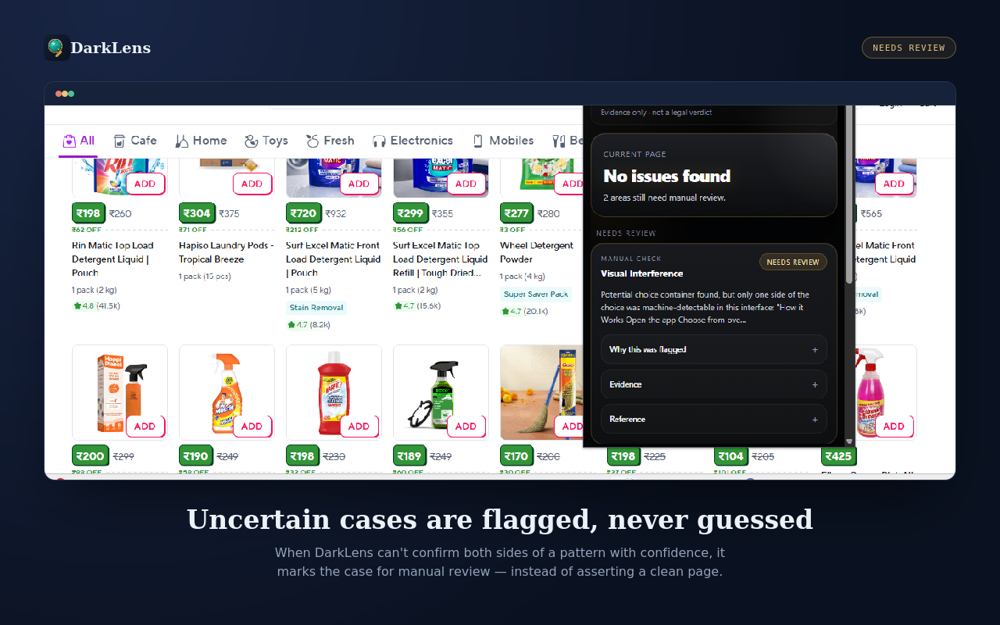
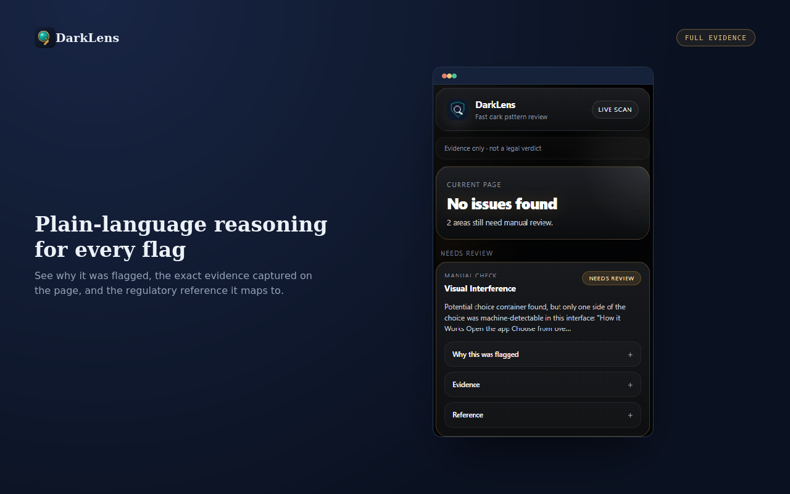

# DarkLens: Dark Pattern Evidence Auditor (V0.2)




> DarkLens detects and documents evidence of potentially manipulative interface patterns. It does not determine legal liability.

**Research question:**
How reliably can automated systems identify manipulative digital interfaces under adversarial conditions, across languages and jurisdictions, without making unsupported legal conclusions?

**What this is:** a portfolio research prototype for AI governance, AI ethics, and AI red-teaming — not a commercial product, not a compliance tool.

## What V0.2 does

A Chrome extension (Manifest V3) that scans the current page's DOM for 3 dark-pattern classes using rule-based detectors, tiers every finding by evidence strength, maps findings to a hand-curated regulatory lookup table, and surfaces results with zero DOM injection into the host page.

| Detector | CCPA 2023 mapping |
|---|---|
| Confirmshaming | Confirm Shaming |
| Preselection (non-essential default opt-in) | Basket Sneaking (adjacent) |
| Visual Interference | Interface Interference |

## Screenshots

| Flagged on a live page | Full evidence, on demand |
|---|---|
|  |  |

## Architecture

```
Page DOM → Pattern Registry (3 isolated detector plugins)
         → Evidence Tier assignment (1–4, not a confidence %)
         → Deterministic Regulatory Lookup Table (static, dated, no RAG)
         → Toolbar badge (signal) + Side Panel (detail, on-demand highlight)
```

**Evaluation status:** End-to-end benchmark results pending until the extension-driven evaluation harness is running. The repository includes benchmark cases and scoring logic, but no published precision / recall / F1 claims should be treated as established for V0.2 yet.

Full folder layout, detector logic, and design constraints are documented in the companion files in `docs/` and in `src/`.

## Explicitly out of scope for V0.2

RAG retrieval, LLM-based classification, confidence-interval scoring, DOM hashing, floating/injected page UI, and any output that names a specific real company or asserts a legal violation. See `SYSTEM-CARD.md` for the full list and rationale.

## Detection method — stated plainly

V0.2 is **rule-based** (regex + DOM inspection). It is not an AI/LLM classifier. If a future version adds LLM-based classification, that version must also add the indirect-prompt-injection threat model described in `RED-TEAM.md`, since webpage text would become untrusted input to a model context at that point.

## More documentation

- [`SYSTEM-CARD.md`](docs/SYSTEM-CARD.md) — capabilities, known limitations, evaluation status
- [`GOVERNANCE.md`](docs/GOVERNANCE.md) — regulatory-mapping rationale and boundaries
- [`RED-TEAM.md`](docs/RED-TEAM.md) — adversarial test cases and threat model

## License

MIT — see [`LICENSE`](LICENSE).
Developed by: Korchipati Kishore Kumar
